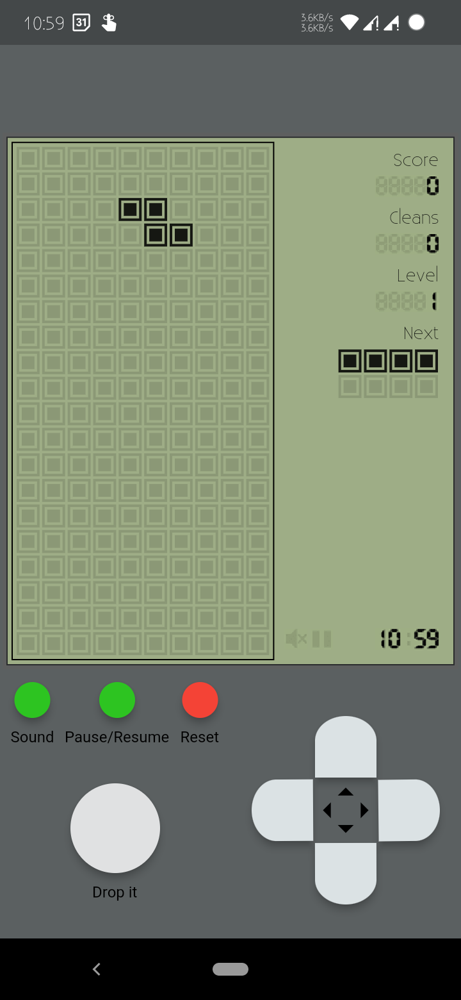
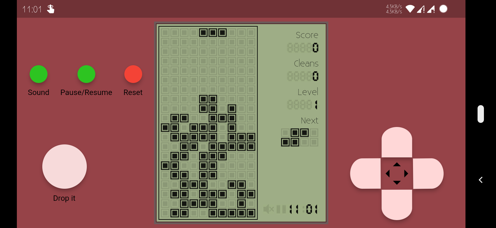

##### _Classic brick game powered by flutter_
Clear Bricks is a popular and addictive puzzle game! A nostalgic handheld game of 90s Kids recreated, a perfect time pass which also improves your logical skill. It supports wallpaper based theme colour on Android 12 and above, so you get different colour each time when you change wallpaper.
## Getting Started
Play Rules:
- Classic brick game without time limits.
- Place the bricks in a reasonable position.
- Create full lines on the grid horizontally to clear bricks.
- The more bricks you clear, the more you score.
- Bricks can be rotated.
- Speed increases on each new level

Lets break the buttons!!! Download from [Play Store](https://play.google.com/store/apps/dev?id=7098510071783404976)
### Preview






#### Build

```
flutter build appbundle --obfuscate --split-debug-info --release
```
